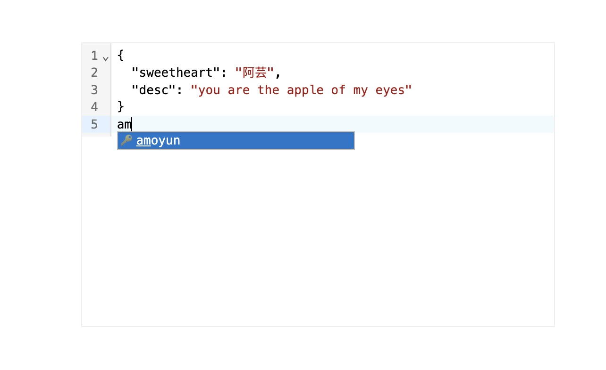

# 简单的介绍

> - 为什么作用域 ***@amoayun***  
> - 因为最初想要的名字是 ***@ayun*** ，但是已经被注册了
> - 为什么最初想要的名字是 ***@ayun*** ？
> - 因为我爱上了一个人，大概是2015年到2016年的时候爱上的，很爱很爱她。我叫她 ***阿芸***，所以 ***@ayun*** 是 ***阿芸*** 的谐音
> - ***在一起了没？***（满足你八卦的心）
> - 没有，但是相信我们的故事正在发生。可能知道结果不尽人意，但是只要见到她就很开心呀，哈哈哈
> - 作为开发者的你 ***现在有喜欢的人吗？***  
>> - ### 愿我家 ***阿芸*** 平安喜乐，万事胜意。
>> - ___愿世界和平___
>> - 愿天下有情人终成眷属
>> - 愿本组件能完美的帮助你呀
  
  <br/>

# 安装

```shell
npm install @amoayun/vue-codemirror --save
```

<br/>

# 基础使用方法

```javascript
// **.vue文件中

<template>
  <AmoAYunCodemirror v-model="jsonData" lang='json' :options="myOptions"/>
</template>

<script setup>
  import { ref } from 'vue';
  import { AmoAYunCodemirror } from '@amoayun/vue-codemirror';
  import '@amoayun/vue-codemirror/dist/style.css';

  const jsonData = ref<string>(JSON.stringify({ "sweetheart": "阿芸", "desc": "you are the apple of my eyes" }, null, 2));

  // 自定义提示项
  const myOptions: any = [
    {
      label: "amoyun",
      type: "keyword",
      apply: JSON.stringify(
        { sweetheart: "阿芸", desc: "you are the apple of my eyes" },
        null,
        2
      ),
    },
  ];
</script>
```

  

| 属性名   | 描述             | 类型                                                                                                    | 默认值 |
| -------- | ---------------- | ------------------------------------------------------------------------------------------------------- | :----: |
| v-mode   | 绑定             | string                                                                                                  |   -    |
| options  | 自定义提示项     | Array<{label: string;type?: "keyword"\|"variable"\|"text"\|'function';apply?: string;detail?: string;}> |   -    |
| dark     | 是否开启暗黑模式 | boolean                                                                                                 |   -    |
| disabled | 是否禁用         | boolean                                                                                                 |   -    |
| lang     | 支持的语法       | 'python'\|'java'\|'javascript'\|'sql'\|'json' 目前只适配了这几种语言                                    |   -    |


> ### 【注意】
> - 当 __lang__ 为 __sql__ 时，配置的 __options__ 会失效（因为我太菜，还没有想到办法适配）
> - 其他的属性你们就可以直接参考 ___[vue-codemirror6](https://github.com/logue/vue-codemirror6)___ 了，我就是个二道贩子，哈哈哈，基于 ___[vue-codemirror6](https://github.com/logue/vue-codemirror6)___  做的一层封装，让大家感觉更方便用一点

<br/>

# 方法

| 方法名     | 描述                      | 参数        | 返回值 |
| ---------- | ------------------------- | ----------- | ------ |
| insertText | 光标位置插入内容          | val: string | -      |
| codeMirror | 组件内部的codeMirror的ref | -           | -      |

<br/>

# 后续
- 我当然会一致坚持啦，哈哈哈，因为看见她我就很开心呀，哈哈哈
- 组件会持续完善的，感谢大家的使用

# 版本更新
## 2024-07-16
- 解决使用函数清空v-model双向绑定的变量的值时候会出现的无响应问题。